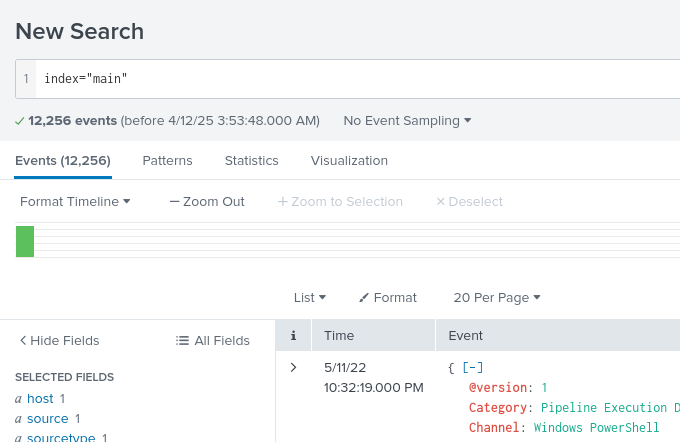
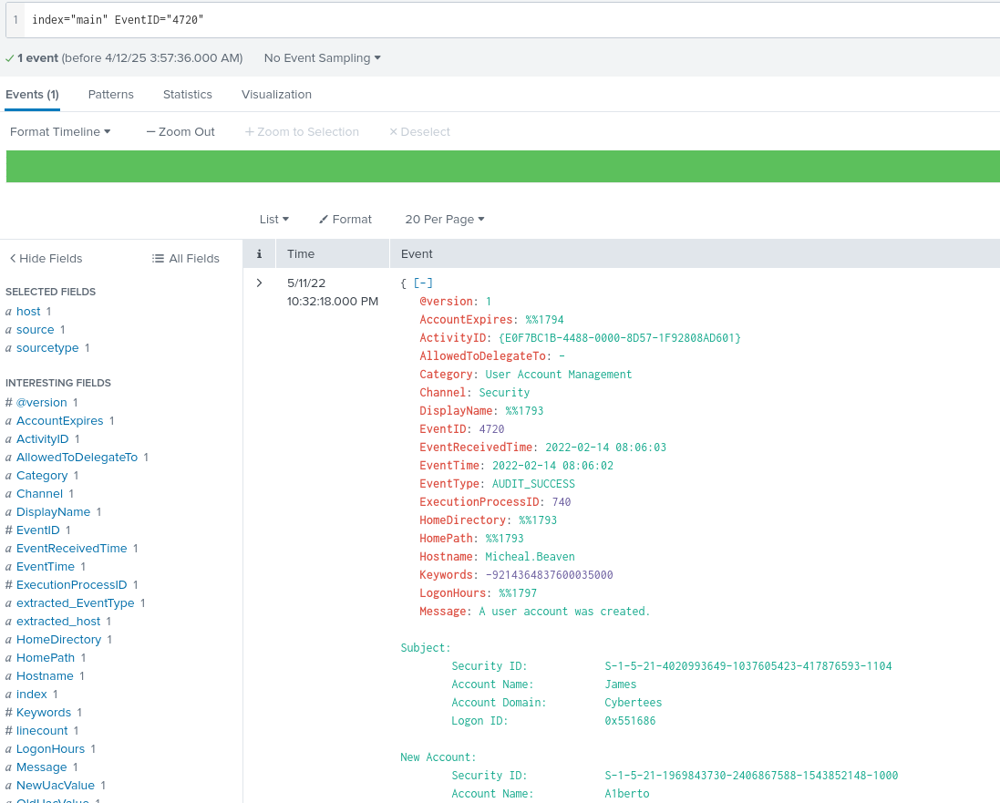
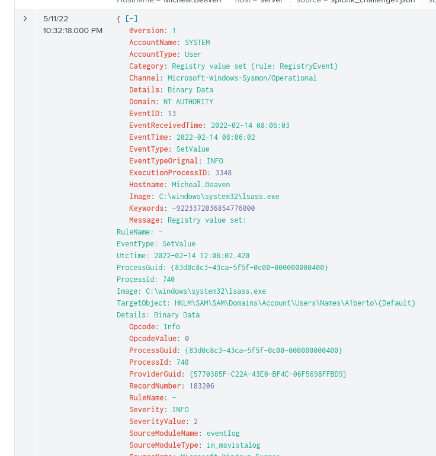
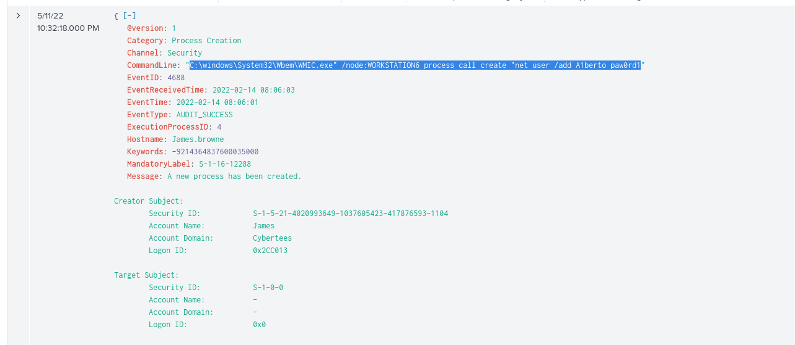
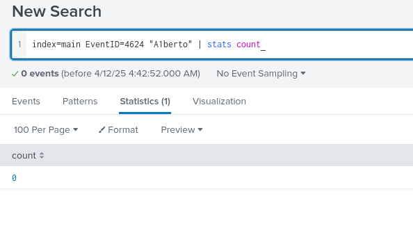
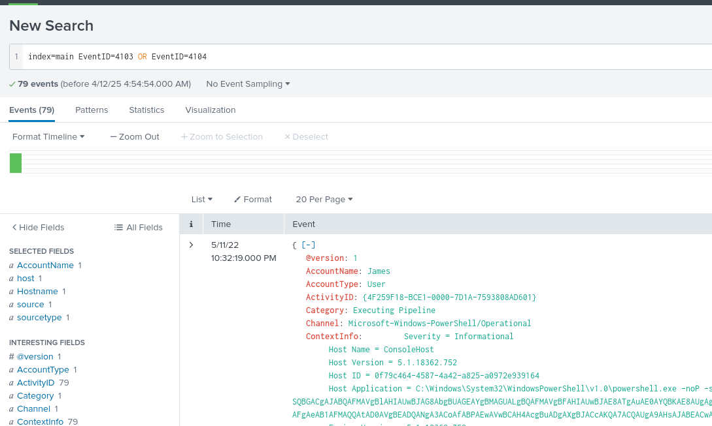
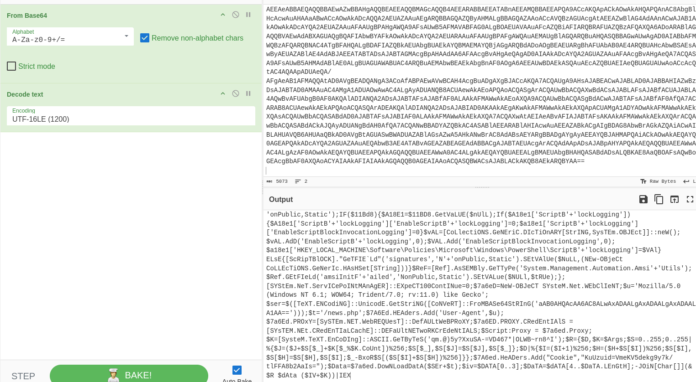

# 🕵️ Investigating with Splunk – TryHackMe Writeup

## 🧠 Scenario Overview

In this lab, we take on the role of a SOC Analyst assisting a colleague, Johny, who has identified anomalous behavior on a number of Windows machines. It appears that an adversary gained access to these hosts and successfully installed a backdoor. Logs from the suspected systems were ingested into **Splunk** for centralized investigation. Our mission: analyze the logs and uncover the attacker's activity.

---

## 🔍 Investigation Questions and Answers

### 1. **How many events were collected and ingested in the index `main`?**  
Loading up the instance and setting the index as 'main' shows us the total events.



**Answer:** `12256`

### 2. **What is the name of the new backdoor user created by the adversary?**  
For this I searched by event ID, found the one corresponding to user creation, and our answer was in the event logs with a sneaky mistype.



**Answer:** `A1berto`

### 3. **What is the full path of the registry key updated for the backdoor user?**  
Here I wanted to search with our user "A1berto" along with the EventID for reg keys being updated. If the ID's are correct we should find our answer.



**Answer:**  
`HKLM\SAM\SAM\Domains\Account\Users\Names\A1berto`

### 4. **Which legitimate user was the adversary trying to impersonate?** 
This one doesn't need much of an explanation hopefully or a photo. 

**Answer:** `Alberto`

### 5. **What command was used to add the backdoor user from a remote computer?**  
I got stuck here for a good minute trying to find the right thing to search. I ended up searching the fields for "net user /add A1berto paw0rd1" and scrolled through a few logs to get our answer as seen in the previous screenshots and found the answer.



**Answer:**
```
C:\windows\System32\Wbem\WMIC.exe" /node:WORKSTATION6 process call create "net user /add A1berto paw0rd1
```

### 6. **How many login attempts from the backdoor user were observed?**  
Not going to lie I thought I was suppose to be getting an answer here, but searching by EventID=4624 for logins and piping the result to a wc showed 0 and that is the answer.



**Answer:** `0`

### 7. **Which infected host executed suspicious PowerShell commands?**  
**Answer:** `James.browne`

### 8. **How many PowerShell events were logged for the malicious execution?**  
Here I had to do a bit of research again on EventIDs and found this https://www.myeventlog.com/search/show/980, https://www.myeventlog.com/search/show/977, regarding EventID:4103, 4104, execute a remote powershell command, and pipeline. Filtering with these will give us our answer of total events.



**Answer:** `79`

### 9. **What is the full URL that the encoded PowerShell script attempted to contact?**  
I love decoding and encoding so this one was quite fun. The giant string in our powershell command is clearly obfuscated directions so I gave it to chatGPT which gave me the decoding instructions. Let's take that to cyberchef and from here we can base64 decode our very long string of characters, and then I want to add UTF-16LE(1200) encoding. Once we have our forumla set, input our string and we'll get a result that looks like this.




There's a section of this command that is encoded one step further, and has a variable set. Take the rest home.

**Answer:**  
`hxxp[://]10[.]10[.]10[.]5/news[.]php`

---

## 📝 Summary

This investigation highlighted how Splunk can be used to rapidly correlate logs across multiple systems, enabling identification of:
- Unauthorized user creation
- Registry modifications
- PowerShell abuse
- Network exfiltration attempts
